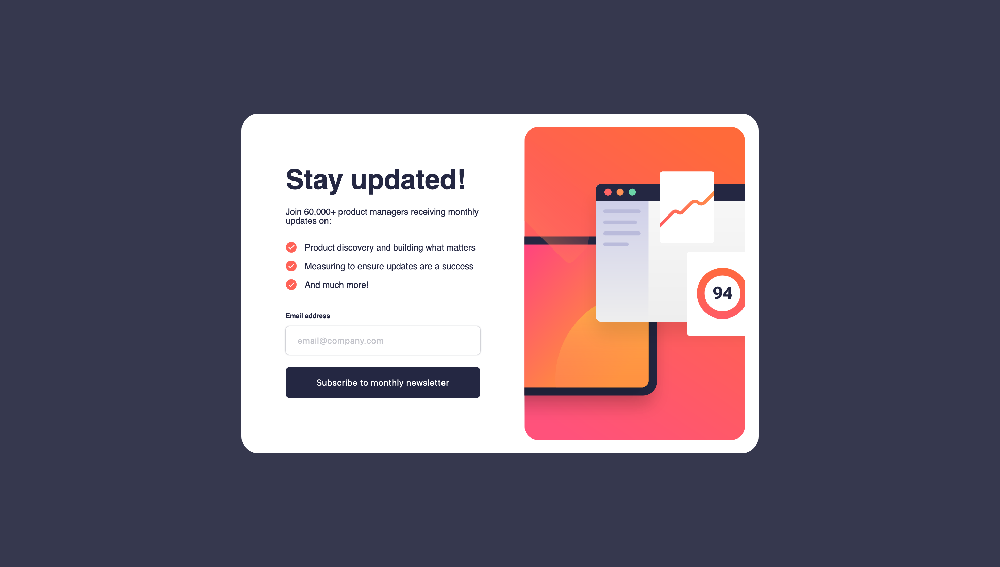

# Frontend Mentor - Newsletter sign-up form with success message solution

This is a solution to the [Newsletter sign-up form with success message challenge on Frontend Mentor](https://www.frontendmentor.io/challenges/newsletter-signup-form-with-success-message-3FC1AZbNrv). Frontend Mentor challenges help you improve your coding skills by building realistic projects. 

## Table of contents

  - [The challenge](#the-challenge)
  - [Screenshot](#screenshot)
  - [Links](#links)
  - [Built with](#built-with)
  - [What I learned](#what-i-learned)
  - [Continued development](#continued-development)
  - [Author](#author)

### The challenge

Users should be able to:

- Add their email and submit the form
- See a success message with their email after successfully submitting the form
- See form validation messages if:
- The field is left empty
- The email address is not formatted correctly
- View the optimal layout for the interface depending on their device's screen size
- See hover and focus states for all interactive elements on the page

### Screenshot

### Links

- Solution URL: [https://github.com/TimmyOGH/Newsletter-Signup]
- Live Site URL: []

### Built with

- CSS custom properties
- Flexbox

### What I learned

I learned how to use min/max widths and heights, and usage of percentages and vw for responsive margins, paddings, and font sizes.

### Continued development

I want to master frontend developement! Cheers 🍻

## Author

- Frontend Mentor - [@timodn](https://www.frontendmentor.io/profile/timodn)
